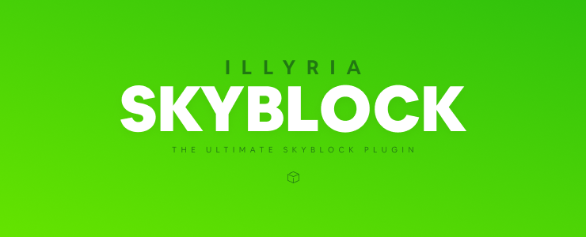

## About
A modern, fully functional skyblock core with minimal dependencies. 
The plugin's primary deployment and testing version is the latest version of spigot available. SkyblockX was designed because of ASkyblock being discontinued and also not being supported past Spigot-1.12 and all replacements being poorly designed or unstable.


### Installation

1. Get a skyblock release binary using one of the following options.
   * Download from [our store](https://store.illyria.io/product/illyria_skyblock).
   * Compile a binary file on your own, see the developers section.
2. Get a spigot binary file.
    * Download [buildtools](https://hub.spigotmc.org/jenkins/job/BuildTools/lastSuccessfulBuild/artifact/target/BuildTools.jar) and compile  a jar; Use the [wiki](https://www.spigotmc.org/wiki/buildtools/) if you're confused on how to do this.
3. Run the compiled Spigot jar.
4. Agree to the EULA & restart.
5. Move the Skyblock binary from step 1 into `/plugins`.
6. Restart the server.

### Tech Stack
* This plugin is built using [Kotlin](https://kotlinlang.org/) which can compile to jvm bytecode.
* [SavageFramework](https://github.com/illyria-io/SavageFramework) for storage management & a collection of tools for cross version support.
* [Gradle](https://gradle.org/) is used for dependency management.
 
### Developers

The plugin is available on our Nexus Repository.
<br/>
**Maven**
```xml
<!-- SavageLabs repository -->
<repository>
    <id>savagelabs</id>
    <url>https://nexus.savagelabs.net/repository/maven-public/</url>
</repository>

<dependency>
  <groupId>io.illyria</groupId>
  <artifactId>SkyblockX</artifactId>
  <version>v1.3.6-alpha</version>
</dependency>
```
**Gradle**
```groovy
repositories {
  maven {
        url 'https://nexus.savagelabs.net/repository/maven-public/'
  }
}

dependencies {
  implementation 'io.illyria:SkyblockX:v1.3.6-alpha'
}
```


